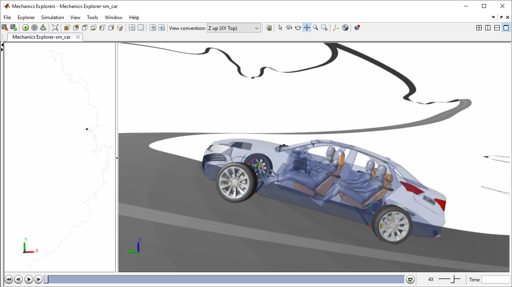

# **Simscape Vehicle Templates**
Copyright 2018-2021 The MathWorks, Inc.

This library contains library blocks and a configurable vehicle model.  
You can:

   1. Select different vehicle types model fidelity levels.
   2. Adjust parameter values for the selected vehicle configuration
   3. Configure the vehicle model to run different open and closed loop maneuvers.
   4. Visualize the simulation results in a 3D animation
   5. Render the results in photo-realistic animation (Unreal Engine)

The templates are designed to be extendable. Create your own variant for any portion 
of the vehicle model (such as the brakes, suspension, or drivetrain) and you can 
adjust the libraries so that variant can be selected.

**Please visit the [Simscape Vehicle Templates](https://www.mathworks.com/solutions/physical-modeling/simscape-vehicle-templates.html) page** for animations and videos that show what you can do with these models.

## **Getting Started**
1. Open the project file sm\_car\_proj.prj 
   - The first time you open it, it takes 10 minutes to load all parameters for all variants from Excel.  
   - Every time after that, the data is loaded from a .MAT file, so it goes quicker.

2. Explore the vehicle types and maneuvers from the UI 

3. Modify parameter values in the "Vehicle" data structure in the MATLAB workspace.
 
### **Release History**
**v2.6 -- November 2021**
1.  Added decoupled suspension linkages: double wishbone, double wishbone no steer, 5 link.
2.  Added decoupled roll and heave stiffness and damping
3.  Added method for generating GGV diagram by sweeping gravity vector and aero loads
4.  Added option to constrain vehicle with no yaw (for GGV tests)
5.  Added option to vary gravity vector (for GGV tests)
6.  Added option to terminate simulation based on maximum speed (for GGV tests)
7.  Added unique aero settings for sedan and FSAE vehicle
8.  Adjusted project startup script to work with parallel simulations
9.  Adjusted four-wheel steering algorithm to make rear steer gain speed-dependent, updated test
10. Fixed plots for showing fastest lap from optimization
11. Fixed startup script to avoid 'dir(**/*)' command on Mac and Linux (for MF-Swift)

**v2.5.1 -- October 2021**
1.  Reduced scaling factor for initial speed in lap time optimizations.

**v2.5 -- October 2021**
1.  Increased initial speed for racetrack events to avoid wheels losing traction at start.

**v2.4 -- September 2021**
1.  Added option to use Simscape Multibody tire model (R2021b and higher)
2.  Fixed parameterization of rim and tire mass, inertia
3.  Changed "Inertia" parameter to "mjRim" for rim mass and inertia

**v2.3 -- June 2021**
1.  Added basic torque vectoring algorithm (rear axle only).
2.  Added 2 templates for double-wishbone suspension, pushrod to upper arm.
3.  Added anti-roll bar with rod linkage.
4.  Added preset based on Formula SAE car sizing.
5.  Adjusted controller and steering systems to permit steering on multiple axles.
6.  Camera frame definitions from MATLAB (was Excel), adjusted Mechanics Explorer configuration
7.  Added basic control parameters for default, ideal powertrain.
8.  Added display elements for battery temperature with test script.
9.  Fixed Ice Patch maneuver, Swift tire (use external road).
10. Updated model for replaying results in Unreal to show two vehicles.

**v2.2 -- May 2021**
1. Added exercises 1-7 to teach basics of Simscape Vehicle Templates
2. Added library and code to work with Simcenter Tire 2021.1 (new .tir parser)
3. Updated fuel cell variant to work with boost converter, averaged switch (R20a and higher only)

**v2.1 -- Mar 2021**
1. Fixed bug in Simscape Vehicle Templates interface to MFeval CPI tire model
2. Updated regenerative braking model to properly account for available motor torque
3. Added serial regenerative braking algorithm for battery 2 motor powertrain
4. Added presets for battery 2 motor powertrain with brake-by-wire for serial regenerative braking
5. Added optimization example for lap time that considers battery SOC in cost function
6. Modified code to handle update to find_system() for active variants in R2021a
7. Increased bandwidth of brake actuators in PedalAbstract

**v2.0 -- Dec 2020**
**Major changes in this release to enable multi-axle vehicles.**
**Datasets compatible with earlier releases will need changes to work with this version.**
1. Added semi-truck (3 axles, 10 wheels), box trailer and tank trailer (2 axles, 8 wheels) 
2. Added optional pendulum slosh model to tank trailer
3. Added second base model (sm_car_Axle3.slx) for 3-axle vehicles pulling 2-axle trailers
4. MATLAB app can be used with base models of any name (model name is a dialog box field)
5. Axles enumerated 1, 2, 3 instead of front, rear
6. Initial values for maneuvers specified in MATLAB (was Excel)
7. Maneuver setup sets initial speed for trailer wheels
8. Data for driver models specified in MATLAB (was Excel)

**v1.6 -- Oct 2020**
1.  Added Event Constant Radius
2.  Added CRG Custom (slot for custom events, copy of CRG Mallory Park)
3.  Added Drive Cycle UrbanCycle1
4.  Added stop conditions (lateral deviation too high, lap complete)
5.  Added lateral deviation to logged results
6.  Corrected lateral deviation calculation
7.  Added example optimization for lap time (Workflows/Optimize)
8.  Removed discrete signals from traffic light signal
9.  Adjusted default trajectory CRG Mallory Park, CRG Nurburgring
10. Adjusted maneuver configuration to stop after one lap (lap events only)
11. Cleaned up trajectory definition sm_car_trajectory_double_lane_change.m

**v1.5 -- Aug 2020**
1. Added power Fuel Cell 1 Motor
2. Added Control data structure with control parameters
3. Added driveline FDiff for front wheel drive
4. Added ssc_car_FuelCell1Motor
5. Added Drive Cycle FTP75, Driver Drive Cycle
6. Consistent parameterization for all electric motor powertrains
7. Fixed bug in import of 2D tables from Excel (were flipped up/down) 

**v1.4 -- Aug 2020**

1. Moved vehicle Body sensor to CG (Vehicle, Vehicle_1Axle). Affects VehBus
2. Added sensors to passengers
3. Added ability to specify road height based on wheel position 
4. Added events Plateau Z Only, Rough Road Z Only
5. Added option to create CRG files based on x-y-z data
6. Added event CRG Plateau
7. Adjusted diagnostic for tire types in sm_car_config_road.m
8. Revised full test scripts - more modular, eliminate FastRestart warnings
   (sm_car_test_variants.m, added sm_car_test_variants_testloop.m)

### **Release History**
**v1.3 -- July 2020**

1. Changed sm_car top level to accommodate overrides from obstacles in scenes
2. Added scene Track Mallory Park Obstacle with stoplights to override speed
3. Adjusted sm_car_config_maneuver to adjust stop conditions, wind conditions
4. Added scene MCity with default trajectory and script to define one from UI
5. Adjusted xTrajectory.vx and Maneuver.vGain so that all vGain values are one
6. Added CRG road Kyalami

**v1.2 -- May 2020**

1. Added MF-Swift, CRG roads (Nurburg, Suzuka, Pikes, Mallory)
2. Swapped in MFeval 4.0
3. Fixed original Mallory park

**v1.1 -- Mar 2020**

1. Added electric powertrain options with cooling circuit

**v1.0 -- Mar 2020**

First release

